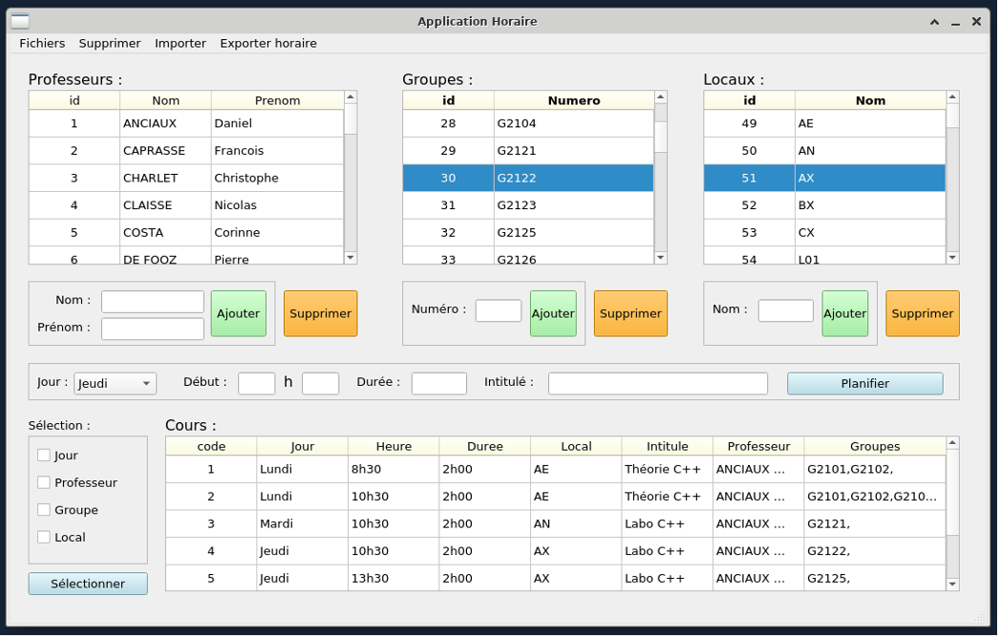

# Horaire

**Horaire** est une application permettant la création d'un horaire au sein d'une école.



## 👷 - Requirements
#### OS - Linux
```
OracleLinux-R8-U4-x86_64-dvd.iso
```
#### SDL 1.2.15
```
# sudo yum install SDL-devel.x86_64
```
#### Qt 5.12.5 and QtCreator 4.12.4
```
# qtcreator
# bash: qtcreator: unknown command...
# Do you want to install the « qt-creator » package which provides the « qtcreator » command ? [N/y]
```
## How To Use It
Go in bash and type
```
makefile
```


## 🐛 - Bugs 
- L'ajout d'un professeur/groupe/local ne se synchronise pas avec les tuples déjà présents
- L'exportation d'un groupe ne se fait pas correctement

## 🛣️ - Roadmap
1. Supprimer un Cours planifié.

## 📝 - Feedback 
Si vous avez quelques retours à me faire parvenir, contactez-moi via <matteo.arnone@student.hepl.be>.

